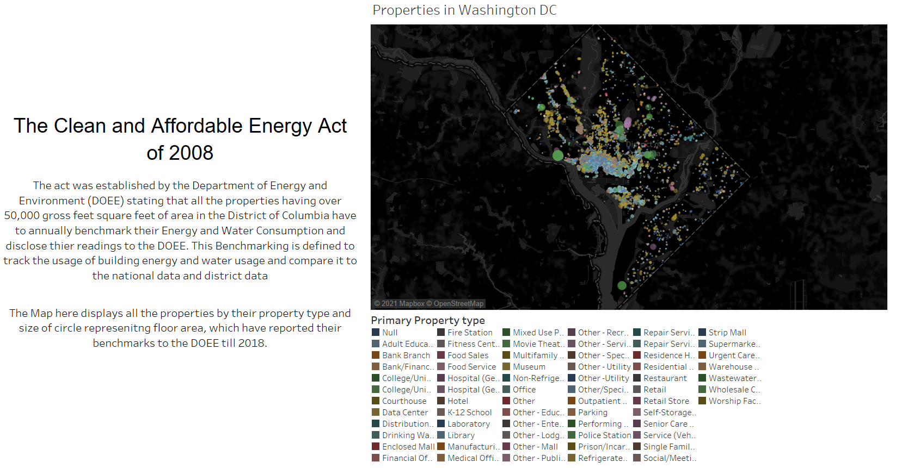
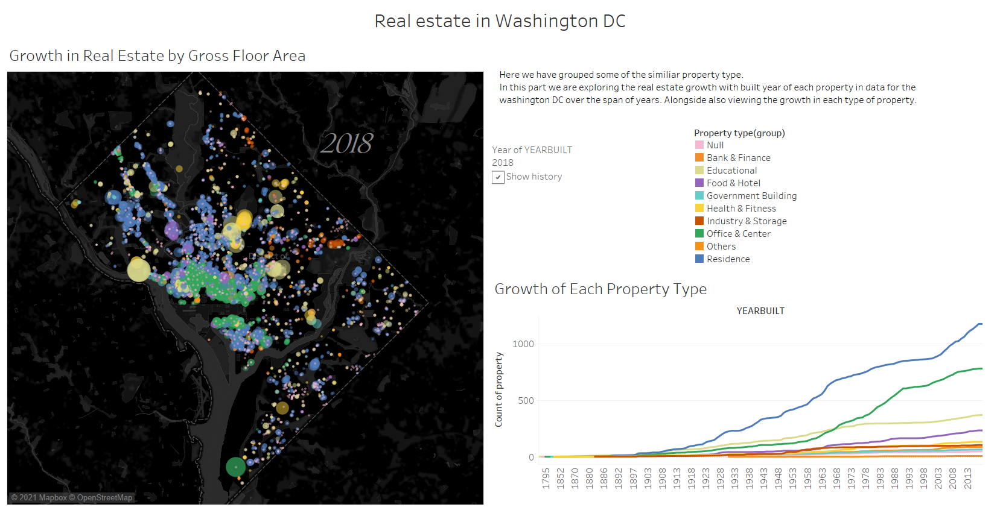
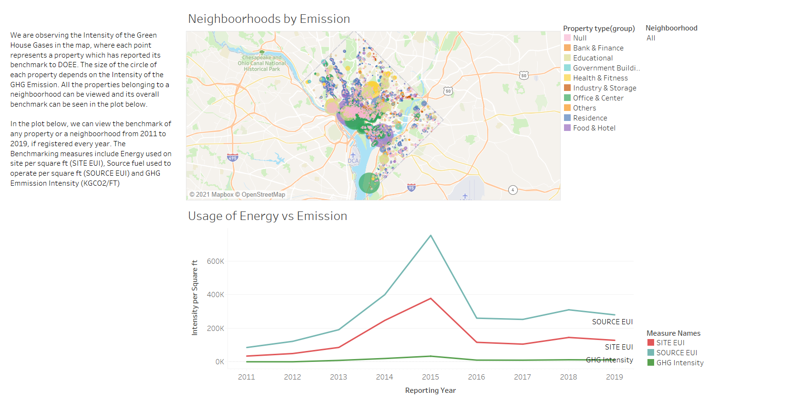
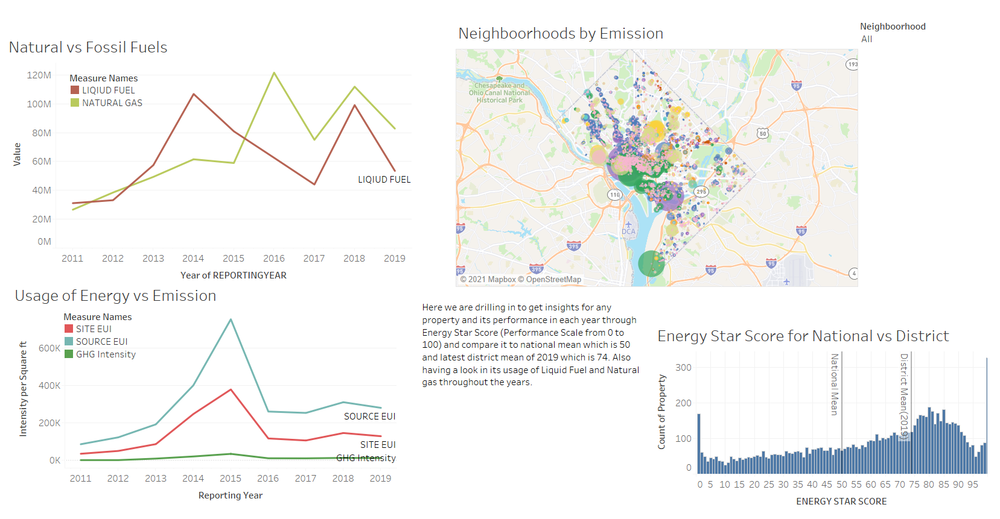

# Beyond Carbon Tableau Visualization

This visualization is made using the data published by the Department of Energy and Environment (DOEE) where information is collected on the The Clean and Affortable Energy Act of 2008.
It contains all the energy and water consumption benchmarks of the properties having over 50,000 gross square feet of area. We have created a visualization to track the usage of building energy and GHG emission.

Dataset: [Building Energy Benchmarks](https://opendata.dc.gov/datasets/building-energy-benchmarks)

#### Introduction

The Map here displays all the properties by their property type and size of circle represenitng floor area, which have reported their benchmarks to the DOEE till 2018.

#### Real Estate in Washington DC

Here we have grouped some of the similiar property type. In this part we are exploring the real estate growth with built year of each property in data for the washington DC over the span of years. Alongside also viewing the growth in each type of property.

#### Neighboorhood Analysis

We are observing the Intensity of the Green House Gases in the map, where each point represents a property which has reported its benchmark to DOEE. The size of the circle of each property depends on the Intensity of the GHG Emission. All the properties belonging to a neighboorhood can be viewed and its overall benchmark can be seen in the plot below.
In the plot below, we can view the benchmark of any property or a neighboorhood from 2011 to 2019, if registered every year. The Benchmarking measures include Energy used on site per square ft (SITE EUI), Source fuel used to operate per square ft (SOURCE EUI) and GHG Emmission Intensity (KGCO2/FT)

#### Energy and GHG analysis

Here we are drilling in to get insights for any property and its performance in each year through Energy Star Score (Performance Scale from 0 to 100) and compare it to national mean which is 50 and latest district mean of 2019 which is 74. Also having a look in its usage of Liquid Fuel and Natural gas throughout the years.

